# Interstellar OS (OSAIMA) — Architecture

One picture tying the two halves of the project together: the **distribution** (a
Gentoo fork) and the **agentic desktop shell** it ships.

```mermaid
flowchart TB
    subgraph UP[Upstream]
        G[Gentoo Linux<br/>packages · profiles · Portage]
    end

    subgraph FORK[Distribution — Gentoo fork &#40;gentoo/overlay&#41;]
        OV[Interstellar overlay<br/>masters = gentoo]
        PROF[Profile<br/>interstellar/base · interstellar/agentic]
        REL[app-misc/interstellar-release<br/>branding · /etc/os-release]
        META[app-misc/interstellar-meta<br/>one-emerge flavor]
        OV --> PROF
        OV --> REL
        OV --> META
    end

    subgraph BUILD[Build pipeline]
        BD[build_distro.sh<br/>stage3 + overlay + profile]
        ISO[create_iso.sh]
        BD --> ISO
    end

    OS[(Interstellar OS<br/>ID_LIKE=gentoo · bootable)]

    subgraph AICORE[AI Core &#40;sys-apps/osaima-ai-core&#41;]
        MCP[MCP daemon<br/>JSON-RPC over Unix socket]
    end

    subgraph SHELL[Agentic Desktop Shell &#40;gui-apps/osaima-shell&#41;]
        LUA[wm.lua config] --> VM[Lua interpreter<br/>lua-vm.js]
        VM --> WM[WM engine<br/>tile · grid · spiral · float · workspaces]
        WM --> APPS[Apps<br/>Assistant · Terminal · Task Manager · Files]
        AGENT[AI layer<br/>reactive assistant · proactive AI Core]
        RAG[RAG engine<br/>retrieval + sources]
        BEH[Behavior learning<br/>on-device profile]
        APPS --- AGENT
        AGENT --- RAG
        AGENT --- BEH
    end

    G --> OV
    PROF --> BD
    REL --> BD
    META --> BD
    BD --> OS
    ISO --> OS

    META -. installs .-> AICORE
    META -. installs .-> SHELL
    OS --> AICORE
    OS --> SHELL
    MCP -- system stats --> APPS

    classDef os fill:#0b2545,stroke:#78b4ff,color:#fff;
    class OS os;
```

## How to read it

- **Upstream → Fork:** We keep **Gentoo as upstream** and maintain only our
  `gentoo/overlay/` — the profile, branding (`interstellar-release`), and a meta
  package. `masters = gentoo` means Portage uses Gentoo by default and *our*
  package only where we provide one.
- **Fork → OS:** `build_distro.sh` unpacks a stage3, layers our overlay, selects
  the Interstellar profile, and emerges the meta package; `create_iso.sh` packs it
  into a bootable image. The system then reports itself as **Interstellar OS**.
- **OS ships two of our packages:**
  - `sys-apps/osaima-ai-core` — the **MCP daemon** exposing live system context.
  - `gui-apps/osaima-shell` — the **agentic desktop shell**.
- **Inside the shell:** a real **Lua config** is executed by a from-scratch **Lua
  interpreter** that drives the **window-manager engine** and its apps. The **AI
  layer** (reactive assistant + proactive AI Core) is backed by a **RAG** engine
  and an on-device **behavior-learning** store, and pulls live stats from the MCP
  daemon.

## The one-liner
> Gentoo, forked into **Interstellar OS** via a clean overlay, shipping a
> **Lua-driven, AI-first desktop shell** with retrieval and behavior learning.
